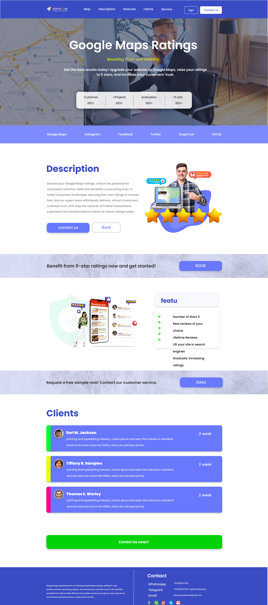

# GoFive Start

GoFive Start is a sleek and attractive website template aimed at providing a great user experience for visitors. The design was developed using Figma and features flexible layouts and a responsive design that adapts to various screen sizes.

## Project Description

GoFive Start is a responsive website template that offers a modern and visually appealing design. It includes a clean and intuitive user interface, smooth animations, and a user-friendly navigation system. The template is suitable for a wide range of applications, such as portfolios, business websites, or personal blogs.

## Preview

You can see a live version of the project by following this link: [GoFive Start Website](https://rebhi-2002.github.io/GoFive_Start/)

## Figma Design

You can explore the original design on Figma and delve into various elements and details. Click the following link to access the design on Figma: [GoFive Start Design on Figma](https://www.figma.com/file/P8o7pQJlVXNnvx3ne16CAb/Untitled)

## Installation and Usage

1. Download the latest version of the project from GitHub.

2. Open the `index.html` file in your web browser.

3. Experience and browse the project, exploring different pages and available components.

## Contributing

If you're interested in contributing to the development of the GoFive Start template, you're welcome to submit contributions. Please read the `CONTRIBUTING.md` file for instructions on how to get involved in the project.

## License

The project is published under the MIT License. Please read the `LICENSE` file for more details.
